# 第3章


```python
import pandas as pd
import numpy as np
from scipy import stats, signal, special
import matplotlib.pyplot as plt
from matplotlib.colors import Normalize
import seaborn as sns
import warnings
from IPython.display import Markdown

sns.set_theme()
warnings.simplefilter("ignore")
```

## Utility Functions


```python
def contourplot(
    df: pd.DataFrame,
    x: str,
    y: str,
    z: str,
):
    # 横持ちにする
    df_z = df.set_index([y, x])[z].unstack()

    # matplotlibの入力の形にする
    x_unique = df_z.columns.values
    y_unique = df_z.index.values
    z_matrix = df_z.values

    fig, ax = plt.subplots()

    # 等高線を描画
    cs = ax.contour(
        x_unique,
        y_unique,
        z_matrix,
        colors="k",
    )
    # 線に数字を載せる
    ax.clabel(
        cs,
        fontsize=10,
    )
    # 色を付ける
    cs = ax.contourf(
        x_unique,
        y_unique,
        z_matrix,
        cmap="coolwarm",
    )
    # カラーバーを追加
    fig.colorbar(cs)
    # ラベルを追加
    ax.set(
        xlabel=x,
        ylabel=y,
        title=z,
    )
```

## 3.1 標本調査

- サンプルサイズ:
    - $N=100$
- 変数$Y$
    - $i$番目の人が政策を支持しているとき:  $Y_i = 1$
    - $i$番目の人が政策を支持していないとき:    $Y_i = 0$

### a

#### $Pr(Y_1 = y_1, \cdots, Y_{100} = y_{100})$ を簡単な形で表す

$Y_1 , \cdots, Y_{100}$ が条件付き独立ということから、

$$
Pr(Y_1 = y_1, \cdots, Y_{100} = y_{100})
= \prod _{i=1} ^{100} Pr(Y_{i} = y_{i} | \theta)
$$

と書ける。

期待値 $\theta$ をもつ二値確率変数の分布関数は

$$
Pr(Y_{i} = y_{i}|\theta)
= \theta^{y_i} (1 - \theta) ^{1 - y_i}
$$

と表すことができる。（これはベルヌーイ分布である）

以上より、

$$
\begin{aligned}
Pr(Y_1 = y_1, \cdots, Y_{100} = y_{100})
&= \prod _{i=1} ^{100} \theta^{y_i} (1 - \theta) ^{1 - y_i} \\
&= \theta^{\sum _{i} y_i} (1 - \theta) ^{100 - \sum _{i} y_i}
\end{aligned}
$$

と表すことができる。
（これは互いに独立で同一のパラメータのベルヌーイ分布に従う100個の確率変数の同時確率である）

#### $Pr(\sum _{i} Y_{i} = y | \theta)$ を求める

$Y = \sum _{i} Y_{i}$ とすると、 確率変数 $Y$ はパラメータ $(n=100, \theta)$ を持つ二項分布に従う。
よって、確率分布は

$$
Pr(\sum _{i} Y_{i} = y | \theta)
= \binom{100}{y}\theta^{y}(1 - \theta)^{100 - y}
$$

となる。

### b


```python
Y = 57
N = 100

df_3_1 = pd.DataFrame()

df_3_1["theta"] = np.linspace(0.0, 1.0, 11)

# 二項分布の確率関数から確率を計算
df_3_1["likelifood"] = df_3_1["theta"].apply(
    lambda theta: stats.binom.pmf(k=Y, n=N, p=theta)
)

df_3_1
```


<div>
<style scoped>
    .dataframe tbody tr th:only-of-type {
        vertical-align: middle;
    }

    .dataframe tbody tr th {
        vertical-align: top;
    }

    .dataframe thead th {
        text-align: right;
    }
</style>
<table border="1" class="dataframe">
  <thead>
    <tr style="text-align: right;">
      <th></th>
      <th>theta</th>
      <th>likelifood</th>
    </tr>
  </thead>
  <tbody>
    <tr>
      <th>0</th>
      <td>0.0</td>
      <td>0.000000e+00</td>
    </tr>
    <tr>
      <th>1</th>
      <td>0.1</td>
      <td>4.107157e-31</td>
    </tr>
    <tr>
      <th>2</th>
      <td>0.2</td>
      <td>3.738459e-16</td>
    </tr>
    <tr>
      <th>3</th>
      <td>0.3</td>
      <td>1.306895e-08</td>
    </tr>
    <tr>
      <th>4</th>
      <td>0.4</td>
      <td>2.285792e-04</td>
    </tr>
    <tr>
      <th>5</th>
      <td>0.5</td>
      <td>3.006864e-02</td>
    </tr>
    <tr>
      <th>6</th>
      <td>0.6</td>
      <td>6.672895e-02</td>
    </tr>
    <tr>
      <th>7</th>
      <td>0.7</td>
      <td>1.853172e-03</td>
    </tr>
    <tr>
      <th>8</th>
      <td>0.8</td>
      <td>1.003535e-07</td>
    </tr>
    <tr>
      <th>9</th>
      <td>0.9</td>
      <td>9.395858e-18</td>
    </tr>
    <tr>
      <th>10</th>
      <td>1.0</td>
      <td>0.000000e+00</td>
    </tr>
  </tbody>
</table>
</div>


```python
_ = sns.relplot(
    df_3_1,
    x="theta",
    y="likelifood",
    kind="line",
)
```


    
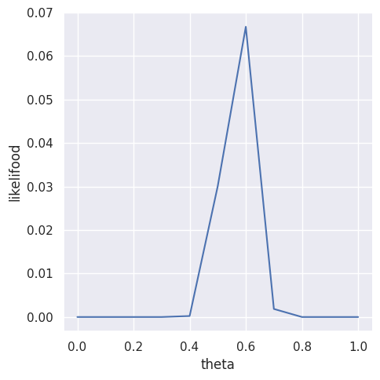
    


### c

ベイズルールを用いると

$$
p\left(\theta | \sum _{i=1}^{100} Y_{i} = 57 \right)
=
\frac{
    p(\sum _{i=1}^{100} Y_{i} = 57 | \theta)p(\theta)
}{
    p(\sum _{i=1}^{100} Y_{i} = 57)
}
$$

と書ける。

ここで、$\theta$ について事前情報がないということから、

$$
\begin{aligned}
p(\theta) &= \frac{1}{11} \\
p \left(\sum _{i=1}^{100} Y_{i} = 57 \right) &=  \sum _{\theta} p \left(\sum _{i=1}^{100} Y_{i} = 57 | \theta \right) \times \frac{1}{11}
\end{aligned}
$$

である。


```python
# thetaの事前分布
# すべての値に対して 1 / 11
prior_theta = 1 / 11

# 周辺尤度
marginal_likelihood = df_3_1["likelifood"].sum() * prior_theta
print(f"{marginal_likelihood=}")

df_3_1["posterior"] = df_3_1["likelifood"].mul(prior_theta).div(marginal_likelihood)

df_3_1
```

    marginal_likelihood=0.008989041496797676


<div>
<style scoped>
    .dataframe tbody tr th:only-of-type {
        vertical-align: middle;
    }

    .dataframe tbody tr th {
        vertical-align: top;
    }

    .dataframe thead th {
        text-align: right;
    }
</style>
<table border="1" class="dataframe">
  <thead>
    <tr style="text-align: right;">
      <th></th>
      <th>theta</th>
      <th>likelifood</th>
      <th>posterior</th>
    </tr>
  </thead>
  <tbody>
    <tr>
      <th>0</th>
      <td>0.0</td>
      <td>0.000000e+00</td>
      <td>0.000000e+00</td>
    </tr>
    <tr>
      <th>1</th>
      <td>0.1</td>
      <td>4.107157e-31</td>
      <td>4.153701e-30</td>
    </tr>
    <tr>
      <th>2</th>
      <td>0.2</td>
      <td>3.738459e-16</td>
      <td>3.780824e-15</td>
    </tr>
    <tr>
      <th>3</th>
      <td>0.3</td>
      <td>1.306895e-08</td>
      <td>1.321705e-07</td>
    </tr>
    <tr>
      <th>4</th>
      <td>0.4</td>
      <td>2.285792e-04</td>
      <td>2.311695e-03</td>
    </tr>
    <tr>
      <th>5</th>
      <td>0.5</td>
      <td>3.006864e-02</td>
      <td>3.040939e-01</td>
    </tr>
    <tr>
      <th>6</th>
      <td>0.6</td>
      <td>6.672895e-02</td>
      <td>6.748515e-01</td>
    </tr>
    <tr>
      <th>7</th>
      <td>0.7</td>
      <td>1.853172e-03</td>
      <td>1.874172e-02</td>
    </tr>
    <tr>
      <th>8</th>
      <td>0.8</td>
      <td>1.003535e-07</td>
      <td>1.014907e-06</td>
    </tr>
    <tr>
      <th>9</th>
      <td>0.9</td>
      <td>9.395858e-18</td>
      <td>9.502335e-17</td>
    </tr>
    <tr>
      <th>10</th>
      <td>1.0</td>
      <td>0.000000e+00</td>
      <td>0.000000e+00</td>
    </tr>
  </tbody>
</table>
</div>


```python
_ = sns.relplot(
    df_3_1,
    x="theta",
    y="posterior",
    kind="line",
)
```


    
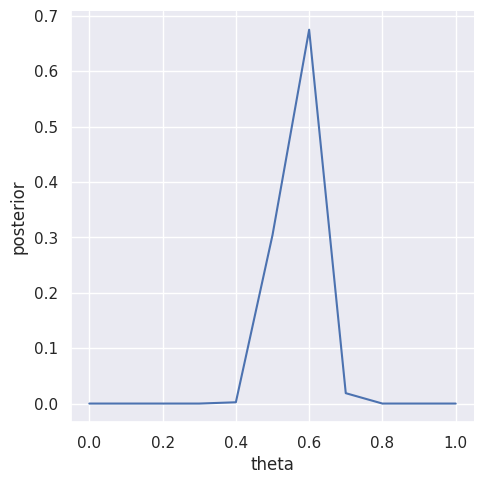
    


### d


```python
df_3_1_continuous = pd.DataFrame()

n_points = 200
df_3_1_continuous["theta"] = np.linspace(0, 1, n_points)

df_3_1_continuous["likelihood"] = df_3_1_continuous["theta"].apply(
    lambda theta: stats.binom.pmf(k=Y, n=N, p=theta)
)

df_3_1_continuous.head()
```


<div>
<style scoped>
    .dataframe tbody tr th:only-of-type {
        vertical-align: middle;
    }

    .dataframe tbody tr th {
        vertical-align: top;
    }

    .dataframe thead th {
        text-align: right;
    }
</style>
<table border="1" class="dataframe">
  <thead>
    <tr style="text-align: right;">
      <th></th>
      <th>theta</th>
      <th>likelihood</th>
    </tr>
  </thead>
  <tbody>
    <tr>
      <th>0</th>
      <td>0.000000</td>
      <td>0.000000e+00</td>
    </tr>
    <tr>
      <th>1</th>
      <td>0.005025</td>
      <td>2.834059e-103</td>
    </tr>
    <tr>
      <th>2</th>
      <td>0.010050</td>
      <td>3.285211e-86</td>
    </tr>
    <tr>
      <th>3</th>
      <td>0.015075</td>
      <td>2.875599e-76</td>
    </tr>
    <tr>
      <th>4</th>
      <td>0.020101</td>
      <td>3.052907e-69</td>
    </tr>
  </tbody>
</table>
</div>


```python
_ = sns.relplot(
    df_3_1_continuous,
    x="theta",
    y="likelihood",
    kind="line",
)
```


    
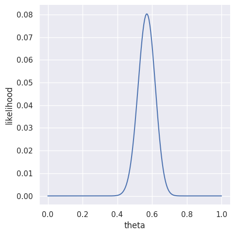
    


### e


```python
df_3_1_posterior = pd.DataFrame()

n_points = 200
df_3_1_posterior["theta"] = np.linspace(0, 1, n_points)

a = 1 + Y
b = 1 + N - Y
df_3_1_posterior["posterior"] = df_3_1_posterior["theta"].apply(
    lambda theta: stats.beta.pdf(x=theta, a=a, b=b)
)

df_3_1_posterior.head()
```


<div>
<style scoped>
    .dataframe tbody tr th:only-of-type {
        vertical-align: middle;
    }

    .dataframe tbody tr th {
        vertical-align: top;
    }

    .dataframe thead th {
        text-align: right;
    }
</style>
<table border="1" class="dataframe">
  <thead>
    <tr style="text-align: right;">
      <th></th>
      <th>theta</th>
      <th>posterior</th>
    </tr>
  </thead>
  <tbody>
    <tr>
      <th>0</th>
      <td>0.000000</td>
      <td>0.000000e+00</td>
    </tr>
    <tr>
      <th>1</th>
      <td>0.005025</td>
      <td>2.862400e-101</td>
    </tr>
    <tr>
      <th>2</th>
      <td>0.010050</td>
      <td>3.318063e-84</td>
    </tr>
    <tr>
      <th>3</th>
      <td>0.015075</td>
      <td>2.904355e-74</td>
    </tr>
    <tr>
      <th>4</th>
      <td>0.020101</td>
      <td>3.083436e-67</td>
    </tr>
  </tbody>
</table>
</div>


```python
_ = sns.relplot(
    df_3_1_posterior,
    x="theta",
    y="posterior",
    kind="line",
)
```


    
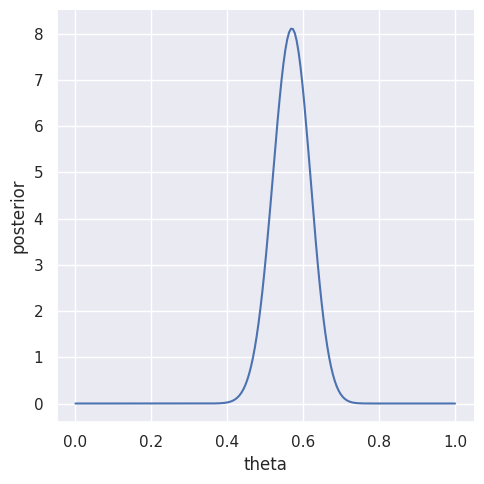
    


- b, cの図は同じ形でスケールだけ異なる
- d, eの図は同じ形でスケールだけ異なる

## 3.2 感度分析


```python
# theta0 と n0 の組み合わせを作る
n_points = 50
theta0 = np.linspace(0.1, 0.9, n_points)
n0 = 2 ** np.linspace(0, 5, n_points)

# データフレームにする
df_3_2 = pd.merge(
    pd.Series(theta0, name="theta0"),
    pd.Series(n0, name="n0"),
    how="cross",
)

# a,b を計算する
df_3_2 = df_3_2.assign(
    a=df_3_2["theta0"].mul(df_3_2["n0"]),
    b=df_3_2["theta0"].rsub(1).mul(df_3_2["n0"]),
)

with pd.option_context("display.max_columns", 20):
    display(df_3_2.round(1).T)
```


<div>
<style scoped>
    .dataframe tbody tr th:only-of-type {
        vertical-align: middle;
    }

    .dataframe tbody tr th {
        vertical-align: top;
    }

    .dataframe thead th {
        text-align: right;
    }
</style>
<table border="1" class="dataframe">
  <thead>
    <tr style="text-align: right;">
      <th></th>
      <th>0</th>
      <th>1</th>
      <th>2</th>
      <th>3</th>
      <th>4</th>
      <th>5</th>
      <th>6</th>
      <th>7</th>
      <th>8</th>
      <th>9</th>
      <th>...</th>
      <th>2490</th>
      <th>2491</th>
      <th>2492</th>
      <th>2493</th>
      <th>2494</th>
      <th>2495</th>
      <th>2496</th>
      <th>2497</th>
      <th>2498</th>
      <th>2499</th>
    </tr>
  </thead>
  <tbody>
    <tr>
      <th>theta0</th>
      <td>0.1</td>
      <td>0.1</td>
      <td>0.1</td>
      <td>0.1</td>
      <td>0.1</td>
      <td>0.1</td>
      <td>0.1</td>
      <td>0.1</td>
      <td>0.1</td>
      <td>0.1</td>
      <td>...</td>
      <td>0.9</td>
      <td>0.9</td>
      <td>0.9</td>
      <td>0.9</td>
      <td>0.9</td>
      <td>0.9</td>
      <td>0.9</td>
      <td>0.9</td>
      <td>0.9</td>
      <td>0.9</td>
    </tr>
    <tr>
      <th>n0</th>
      <td>1.0</td>
      <td>1.1</td>
      <td>1.2</td>
      <td>1.2</td>
      <td>1.3</td>
      <td>1.4</td>
      <td>1.5</td>
      <td>1.6</td>
      <td>1.8</td>
      <td>1.9</td>
      <td>...</td>
      <td>16.9</td>
      <td>18.2</td>
      <td>19.5</td>
      <td>20.9</td>
      <td>22.5</td>
      <td>24.1</td>
      <td>25.9</td>
      <td>27.8</td>
      <td>29.8</td>
      <td>32.0</td>
    </tr>
    <tr>
      <th>a</th>
      <td>0.1</td>
      <td>0.1</td>
      <td>0.1</td>
      <td>0.1</td>
      <td>0.1</td>
      <td>0.1</td>
      <td>0.2</td>
      <td>0.2</td>
      <td>0.2</td>
      <td>0.2</td>
      <td>...</td>
      <td>15.2</td>
      <td>16.4</td>
      <td>17.6</td>
      <td>18.8</td>
      <td>20.2</td>
      <td>21.7</td>
      <td>23.3</td>
      <td>25.0</td>
      <td>26.8</td>
      <td>28.8</td>
    </tr>
    <tr>
      <th>b</th>
      <td>0.9</td>
      <td>1.0</td>
      <td>1.0</td>
      <td>1.1</td>
      <td>1.2</td>
      <td>1.3</td>
      <td>1.4</td>
      <td>1.5</td>
      <td>1.6</td>
      <td>1.7</td>
      <td>...</td>
      <td>1.7</td>
      <td>1.8</td>
      <td>2.0</td>
      <td>2.1</td>
      <td>2.2</td>
      <td>2.4</td>
      <td>2.6</td>
      <td>2.8</td>
      <td>3.0</td>
      <td>3.2</td>
    </tr>
  </tbody>
</table>
<p>4 rows × 2500 columns</p>
</div>


```python
def probability_3_2(a: float, b: float) -> float:
    # 事後分布のa, b
    a_post = a + Y
    b_post = b + N - Y

    # theta > 0.5 の確率
    thresh = 0.5
    proba = 1 - stats.beta.cdf(x=thresh, a=a_post, b=b_post)

    return proba
```


```python
df_3_2["probability"] = df_3_2.apply(
    lambda row: probability_3_2(a=row["a"], b=row["b"]),
    axis=1,
)

with pd.option_context("display.max_columns", 20):
    display(df_3_2.T.round(2))
```


<div>
<style scoped>
    .dataframe tbody tr th:only-of-type {
        vertical-align: middle;
    }

    .dataframe tbody tr th {
        vertical-align: top;
    }

    .dataframe thead th {
        text-align: right;
    }
</style>
<table border="1" class="dataframe">
  <thead>
    <tr style="text-align: right;">
      <th></th>
      <th>0</th>
      <th>1</th>
      <th>2</th>
      <th>3</th>
      <th>4</th>
      <th>5</th>
      <th>6</th>
      <th>7</th>
      <th>8</th>
      <th>9</th>
      <th>...</th>
      <th>2490</th>
      <th>2491</th>
      <th>2492</th>
      <th>2493</th>
      <th>2494</th>
      <th>2495</th>
      <th>2496</th>
      <th>2497</th>
      <th>2498</th>
      <th>2499</th>
    </tr>
  </thead>
  <tbody>
    <tr>
      <th>theta0</th>
      <td>0.10</td>
      <td>0.10</td>
      <td>0.10</td>
      <td>0.10</td>
      <td>0.10</td>
      <td>0.10</td>
      <td>0.10</td>
      <td>0.10</td>
      <td>0.10</td>
      <td>0.10</td>
      <td>...</td>
      <td>0.90</td>
      <td>0.90</td>
      <td>0.90</td>
      <td>0.90</td>
      <td>0.90</td>
      <td>0.90</td>
      <td>0.90</td>
      <td>0.90</td>
      <td>0.90</td>
      <td>0.9</td>
    </tr>
    <tr>
      <th>n0</th>
      <td>1.00</td>
      <td>1.07</td>
      <td>1.15</td>
      <td>1.24</td>
      <td>1.33</td>
      <td>1.42</td>
      <td>1.53</td>
      <td>1.64</td>
      <td>1.76</td>
      <td>1.89</td>
      <td>...</td>
      <td>16.93</td>
      <td>18.17</td>
      <td>19.50</td>
      <td>20.93</td>
      <td>22.47</td>
      <td>24.11</td>
      <td>25.88</td>
      <td>27.78</td>
      <td>29.81</td>
      <td>32.0</td>
    </tr>
    <tr>
      <th>a</th>
      <td>0.10</td>
      <td>0.11</td>
      <td>0.12</td>
      <td>0.12</td>
      <td>0.13</td>
      <td>0.14</td>
      <td>0.15</td>
      <td>0.16</td>
      <td>0.18</td>
      <td>0.19</td>
      <td>...</td>
      <td>15.24</td>
      <td>16.36</td>
      <td>17.55</td>
      <td>18.84</td>
      <td>20.22</td>
      <td>21.70</td>
      <td>23.29</td>
      <td>25.00</td>
      <td>26.83</td>
      <td>28.8</td>
    </tr>
    <tr>
      <th>b</th>
      <td>0.90</td>
      <td>0.97</td>
      <td>1.04</td>
      <td>1.11</td>
      <td>1.19</td>
      <td>1.28</td>
      <td>1.38</td>
      <td>1.48</td>
      <td>1.58</td>
      <td>1.70</td>
      <td>...</td>
      <td>1.69</td>
      <td>1.82</td>
      <td>1.95</td>
      <td>2.09</td>
      <td>2.25</td>
      <td>2.41</td>
      <td>2.59</td>
      <td>2.78</td>
      <td>2.98</td>
      <td>3.2</td>
    </tr>
    <tr>
      <th>probability</th>
      <td>0.91</td>
      <td>0.91</td>
      <td>0.90</td>
      <td>0.90</td>
      <td>0.90</td>
      <td>0.90</td>
      <td>0.90</td>
      <td>0.90</td>
      <td>0.90</td>
      <td>0.89</td>
      <td>...</td>
      <td>0.99</td>
      <td>1.00</td>
      <td>1.00</td>
      <td>1.00</td>
      <td>1.00</td>
      <td>1.00</td>
      <td>1.00</td>
      <td>1.00</td>
      <td>1.00</td>
      <td>1.0</td>
    </tr>
  </tbody>
</table>
<p>5 rows × 2500 columns</p>
</div>


```python
contourplot(
    df_3_2,
    "n0",
    "theta0",
    "probability",
)
```


    
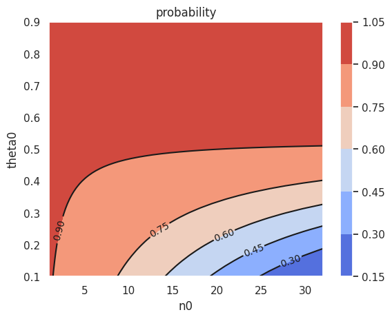
    


等高線プロットから、以下のことがわかる。

- $\theta_0$ が大きい(だいたい0.3以上) または $n_0$ が小さい(だいたい15以下) の領域では $Pr(\theta > 0.5 | \sum Y_i = 57)$ は大きくなる。
- $\theta_0$ が小さい(だいたい0.3以下) かつ $n_0$ が大きい(だいたい15以上) の領域では $Pr(\theta > 0.5 | \sum Y_i = 57)$ は小さくなる。

以上から、次のような解釈をする。

- 事前の $\theta_0$ が0.3以上の場合は $\theta > 0.5$ を信用してよい。
- 事前の $\theta_0$ が0.3より小さい場合
    - 事前の信念の強さ $n_0$ が15以下のときは $\theta > 0.5$ を信用してよい。
    - 事前の信念の強さ $n_0$ が15より大きいときは $\theta > 0.5$ を信用できない。

## 3.3 腫瘍数


```python
y_A = [12, 9, 12, 14, 13, 13, 15, 8, 15, 6]
y_B = [11, 11, 10, 9, 9, 8, 7, 10, 6, 8, 8, 9, 7]
```


```python
print("A系統のデータの要約統計量")
print(stats.describe(y_A))
print()
print("B系統のデータの要約統計量")
print(stats.describe(y_B))
```

    A系統のデータの要約統計量
    DescribeResult(nobs=10, minmax=(6, 15), mean=11.7, variance=9.344444444444445, skewness=-0.6848989298454216, kurtosis=-0.784392624713516)
    
    B系統のデータの要約統計量
    DescribeResult(nobs=13, minmax=(6, 11), mean=8.692307692307692, variance=2.3974358974358974, skewness=-0.024886573315266888, kurtosis=-0.9230890217049392)


### a


```python
def summarise_poisson_gamma(a, b, y, print_results=False):
    # 結果を保存する辞書
    results_dict = {}

    # 事後分布のパラメータ
    a_posterior = a + np.sum(y)
    b_posterior = b + len(y)
    results_dict["a_posterior"] = a_posterior
    results_dict["b_posterior"] = b_posterior

    # 事後平均
    posterior_mean = a_posterior / b_posterior
    results_dict["posterior_mean"] = posterior_mean

    # 事後分散
    posterior_var = a_posterior / (b_posterior**2)
    results_dict["posterior_var"] = posterior_var

    # 信用区間
    credible_interval = stats.gamma.interval(
        confidence=0.95, a=a_posterior, scale=1 / b_posterior
    )
    results_dict["credible_interval"] = credible_interval

    if print_results:
        print(
            "Posterior Distributiion:\n",
            f"\tgamma({a_posterior}, {b_posterior})",
            end="\n",
        )
        print("Posterior Mean:\n", f"\t {posterior_mean}", end="\n")
        print("Posterior Variance:\n", f"\t {posterior_var}", end="\n")
        print("95% Credible Interval:\n", f"\t {credible_interval}", end="\n")

    return results_dict
```


```python
results_A = summarise_poisson_gamma(
    a=120,
    b=10,
    y=y_A,
    print_results=True,
)
```

    Posterior Distributiion:
     	gamma(237, 20)
    Posterior Mean:
     	 11.85
    Posterior Variance:
     	 0.5925
    95% Credible Interval:
     	 (10.389238190941795, 13.405448325642006)


```python
results_B = summarise_poisson_gamma(
    a=12,
    b=1,
    y=y_B,
    print_results=True,
)
```

    Posterior Distributiion:
     	gamma(125, 14)
    Posterior Mean:
     	 8.928571428571429
    Posterior Variance:
     	 0.6377551020408163
    95% Credible Interval:
     	 (7.432064219464302, 10.560308149242363)


### b


```python
df_3_3 = pd.DataFrame()

df_3_3["n0"] = np.arange(1, 50 + 1)
df_3_3["a"] = df_3_3["n0"].mul(12)
df_3_3["b"] = df_3_3["n0"]

df_3_3["posterior_mean"] = df_3_3.apply(
    lambda row: summarise_poisson_gamma(a=row["a"], b=row["b"], y=y_B)[
        "posterior_mean"
    ],
    axis=1,
)

df_3_3.head()
```


<div>
<style scoped>
    .dataframe tbody tr th:only-of-type {
        vertical-align: middle;
    }

    .dataframe tbody tr th {
        vertical-align: top;
    }

    .dataframe thead th {
        text-align: right;
    }
</style>
<table border="1" class="dataframe">
  <thead>
    <tr style="text-align: right;">
      <th></th>
      <th>n0</th>
      <th>a</th>
      <th>b</th>
      <th>posterior_mean</th>
    </tr>
  </thead>
  <tbody>
    <tr>
      <th>0</th>
      <td>1</td>
      <td>12</td>
      <td>1</td>
      <td>8.928571</td>
    </tr>
    <tr>
      <th>1</th>
      <td>2</td>
      <td>24</td>
      <td>2</td>
      <td>9.133333</td>
    </tr>
    <tr>
      <th>2</th>
      <td>3</td>
      <td>36</td>
      <td>3</td>
      <td>9.312500</td>
    </tr>
    <tr>
      <th>3</th>
      <td>4</td>
      <td>48</td>
      <td>4</td>
      <td>9.470588</td>
    </tr>
    <tr>
      <th>4</th>
      <td>5</td>
      <td>60</td>
      <td>5</td>
      <td>9.611111</td>
    </tr>
  </tbody>
</table>
</div>


```python
_ = sns.relplot(
    df_3_3,
    x="n0",
    y="posterior_mean",
    aspect=1.5,
).set(ylim=(None, 12.0))
```


    
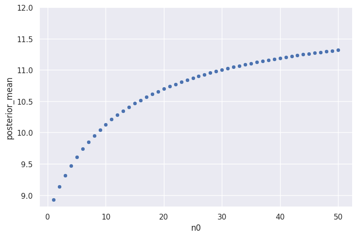
    


$\theta_B$ の事後期待値が $\theta_A$ の事後期待値 (= 11.85) に近い値をとるためには、大きい $n_0$ をとる必要がある。
つまり、$\theta_B = 12$ であるという強い信念が必要となる。

### c

TBW

## 3.4 ベータ事前分布の混合


```python
# 36カ月以内に投獄から解放された人数
n = 43

# 再犯者の人数
y = 15
```

### a

それぞれの分布は

$$
\begin{aligned}
p(\theta) &= dbeta(\theta, a=2, b=8) \\
p(y|\theta) &= dbinom(y, n, \theta) \\
p(\theta| y) &= dbeta(\theta, a + y, b + n - y) \\
\end{aligned}
$$
である。


```python
def construct_df_3_4(a, b, y, n):
    df_3_4 = pd.DataFrame()

    # 1~0のthetaの値を作成
    n_points = 200
    df_3_4["theta"] = np.linspace(0, 1, n_points)

    # 事前分布
    df_3_4["prior"] = stats.beta.pdf(df_3_4["theta"], a=a, b=b)

    # 尤度
    df_3_4["likelihood"] = stats.binom.pmf(y, n=n, p=df_3_4["theta"])

    # 事後分布
    df_3_4["posterior"] = stats.beta.pdf(df_3_4["theta"], a=(a + y), b=(b + n - y))

    return df_3_4
```


```python
def plot_3_4(df):
    mosaic = [
        ["prior"],
        ["likelihood"],
        ["posterior"],
    ]
    fig, axes = plt.subplot_mosaic(mosaic, figsize=(6, 5))

    # 事前分布
    axes["prior"].set(title="Prior")
    sns.lineplot(
        df,
        x="theta",
        y="prior",
        ax=axes["prior"],
    )

    # 尤度
    axes["likelihood"].set(title="Likelihood")
    sns.lineplot(
        df,
        x="theta",
        y="likelihood",
        ax=axes["likelihood"],
    )

    # 事後分布
    axes["posterior"].set(title="Posterior")
    sns.lineplot(
        df,
        x="theta",
        y="posterior",
        ax=axes["posterior"],
    )

    fig.tight_layout()

    return fig
```


```python
def summarise_binom_beta(a, b, y, n, print_results=False):
    # 結果を保存する辞書
    results_dict = {}

    # 事後分布のパラメータ
    a_posterior = a + y
    b_posterior = b + n - y
    results_dict["a_posterior"] = a_posterior
    results_dict["b_posterior"] = b_posterior

    # 事後平均, 事後分散
    posterior_mean, posterior_var = stats.beta.stats(
        a=a_posterior, b=b_posterior, moments="mv"
    )
    results_dict["posterior_mean"] = posterior_mean
    results_dict["posterior_var"] = posterior_var
    results_dict["posterior_std"] = np.sqrt(posterior_var)

    # 信用区間
    credible_interval = stats.beta.interval(
        confidence=0.95, a=a_posterior, b=b_posterior
    )
    results_dict["credible_interval"] = credible_interval

    if print_results:
        print(
            "Posterior Distributiion:\n",
            f"\t beta({a_posterior}, {b_posterior})",
            end="\n",
        )
        print("Posterior Mean:\n", f"\t {posterior_mean}", end="\n")
        print("Posterior Variance:\n", f"\t {posterior_var}", end="\n")
        print("95% Credible Interval:\n", f"\t {credible_interval}", end="\n")

    return results_dict
```


```python
# 事前分布のパラメータ
a, b = 2, 8

df_3_4_a = construct_df_3_4(a=a, b=b, y=y, n=n)
df_3_4_a.head()
```


<div>
<style scoped>
    .dataframe tbody tr th:only-of-type {
        vertical-align: middle;
    }

    .dataframe tbody tr th {
        vertical-align: top;
    }

    .dataframe thead th {
        text-align: right;
    }
</style>
<table border="1" class="dataframe">
  <thead>
    <tr style="text-align: right;">
      <th></th>
      <th>theta</th>
      <th>prior</th>
      <th>likelihood</th>
      <th>posterior</th>
    </tr>
  </thead>
  <tbody>
    <tr>
      <th>0</th>
      <td>0.000000</td>
      <td>0.000000</td>
      <td>0.000000e+00</td>
      <td>0.000000e+00</td>
    </tr>
    <tr>
      <th>1</th>
      <td>0.005025</td>
      <td>0.349272</td>
      <td>4.329615e-24</td>
      <td>5.170957e-23</td>
    </tr>
    <tr>
      <th>2</th>
      <td>0.010050</td>
      <td>0.674220</td>
      <td>1.231199e-19</td>
      <td>2.838488e-18</td>
    </tr>
    <tr>
      <th>3</th>
      <td>0.015075</td>
      <td>0.975937</td>
      <td>4.675335e-17</td>
      <td>1.560242e-15</td>
    </tr>
    <tr>
      <th>4</th>
      <td>0.020101</td>
      <td>1.255481</td>
      <td>3.031747e-15</td>
      <td>1.301549e-13</td>
    </tr>
  </tbody>
</table>
</div>


```python
fig = plot_3_4(df_3_4_a)
```


    
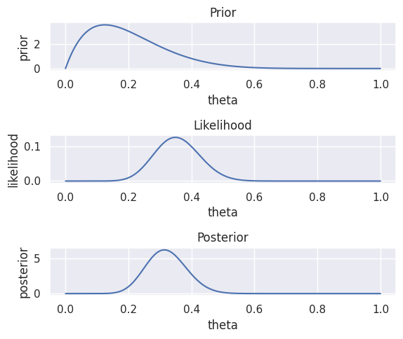
    


```python
results_a = summarise_binom_beta(a, b, y, n, print_results=True)
```

    Posterior Distributiion:
     	 beta(17, 36)
    Posterior Mean:
     	 0.32075471698113206
    Posterior Variance:
     	 0.004034650528064555
    95% Credible Interval:
     	 (0.2032977878191033, 0.4510239822166316)


### b


```python
# 事前分布のパラメータ
a, b = 8, 2

df_3_4_b = construct_df_3_4(a=a, b=b, y=y, n=n)
df_3_4_b.head()
```


<div>
<style scoped>
    .dataframe tbody tr th:only-of-type {
        vertical-align: middle;
    }

    .dataframe tbody tr th {
        vertical-align: top;
    }

    .dataframe thead th {
        text-align: right;
    }
</style>
<table border="1" class="dataframe">
  <thead>
    <tr style="text-align: right;">
      <th></th>
      <th>theta</th>
      <th>prior</th>
      <th>likelihood</th>
      <th>posterior</th>
    </tr>
  </thead>
  <tbody>
    <tr>
      <th>0</th>
      <td>0.000000</td>
      <td>0.000000e+00</td>
      <td>0.000000e+00</td>
      <td>0.000000e+00</td>
    </tr>
    <tr>
      <th>1</th>
      <td>0.005025</td>
      <td>5.796597e-15</td>
      <td>4.329615e-24</td>
      <td>1.866924e-35</td>
    </tr>
    <tr>
      <th>2</th>
      <td>0.010050</td>
      <td>7.382171e-13</td>
      <td>1.231199e-19</td>
      <td>6.761087e-29</td>
    </tr>
    <tr>
      <th>3</th>
      <td>0.015075</td>
      <td>1.254910e-11</td>
      <td>4.675335e-17</td>
      <td>4.364452e-25</td>
    </tr>
    <tr>
      <th>4</th>
      <td>0.020101</td>
      <td>9.353248e-11</td>
      <td>3.031747e-15</td>
      <td>2.109403e-22</td>
    </tr>
  </tbody>
</table>
</div>


```python
fig = plot_3_4(df_3_4_b)
```


    
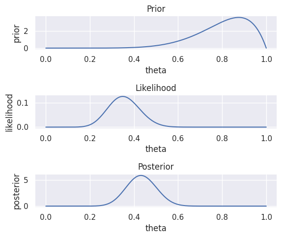
    


```python
results_b = summarise_binom_beta(a, b, y, n, print_results=True)
```

    Posterior Distributiion:
     	 beta(23, 30)
    Posterior Mean:
     	 0.4339622641509434
    Posterior Variance:
     	 0.0045488706934061155
    95% Credible Interval:
     	 (0.30469562471174694, 0.567952795996458)


### c


```python
df_3_4_c = df_3_4_a[["theta", "prior"]].copy()
df_3_4_c.rename(columns={"prior": "prior_a"}, inplace=True)

df_3_4_c["prior_b"] = df_3_4_b["prior"]

df_3_4_c["prior_c"] = (3 / 4) * df_3_4_a["prior"] + (1 / 4) * df_3_4_b["prior"]

df_3_4_c.head()
```


<div>
<style scoped>
    .dataframe tbody tr th:only-of-type {
        vertical-align: middle;
    }

    .dataframe tbody tr th {
        vertical-align: top;
    }

    .dataframe thead th {
        text-align: right;
    }
</style>
<table border="1" class="dataframe">
  <thead>
    <tr style="text-align: right;">
      <th></th>
      <th>theta</th>
      <th>prior_a</th>
      <th>prior_b</th>
      <th>prior_c</th>
    </tr>
  </thead>
  <tbody>
    <tr>
      <th>0</th>
      <td>0.000000</td>
      <td>0.000000</td>
      <td>0.000000e+00</td>
      <td>0.000000</td>
    </tr>
    <tr>
      <th>1</th>
      <td>0.005025</td>
      <td>0.349272</td>
      <td>5.796597e-15</td>
      <td>0.261954</td>
    </tr>
    <tr>
      <th>2</th>
      <td>0.010050</td>
      <td>0.674220</td>
      <td>7.382171e-13</td>
      <td>0.505665</td>
    </tr>
    <tr>
      <th>3</th>
      <td>0.015075</td>
      <td>0.975937</td>
      <td>1.254910e-11</td>
      <td>0.731953</td>
    </tr>
    <tr>
      <th>4</th>
      <td>0.020101</td>
      <td>1.255481</td>
      <td>9.353248e-11</td>
      <td>0.941611</td>
    </tr>
  </tbody>
</table>
</div>


```python
g = sns.relplot(
    df_3_4_c.melt(id_vars="theta"),
    x="theta",
    y="value",
    row="variable",
    kind="line",
    height=2,
    aspect=3,
)
# タイトルを編集
axes = g.axes.ravel()
titles = [
    "beta(2, 8)",
    "beta(8, 2)",
    r"$\frac{3}{4}$beta(2, 8) + $\frac{1}{4}$beta(8, 2)",
]
_ = [ax.set(title=title) for ax, title in zip(axes, titles)]
```


    
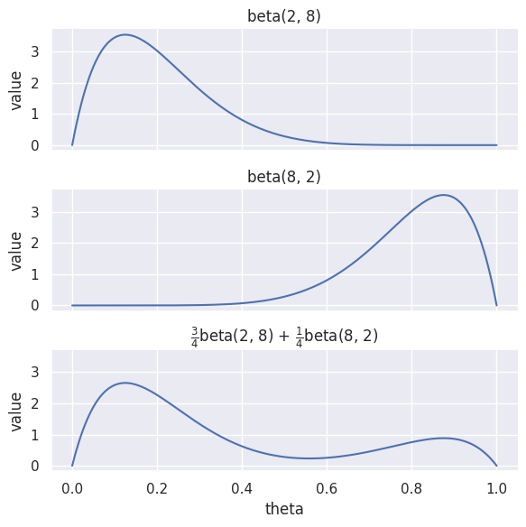
    


cの事前分布は $\theta \approx 0.1$ に大きいピークと $\theta \approx 0.9$ に小さいピークを持つ。  
これは、投獄から解放された人が75%ほどの再犯率の低いグループと25%ほどの再犯率の高いグループから構成されるという事前情報を表している。

### d

#### i

$$
\begin{aligned}
p(\theta) \times p(y | \theta)
&= \frac{1}{4} 
\frac{\Gamma(10)}{\Gamma(2)\Gamma(8)}
[3\theta(1 - \theta)^{7} + \theta^{7}(1 - \theta)]
\times
\binom{n}{y}
\theta^{y}(1 - \theta)^{n - y}
\\
&= 
\frac{\Gamma(10)}{\Gamma(2)\Gamma(8)}
\binom{n}{y}
\times
\left[
\frac{3}{4} \theta^{y + 1} (1 - \theta)^{n - y + 7}
+ \frac{1}{4} \theta^{y + 7} (1 - \theta)^{n - y + 1}
\right]
\\
&=
\left[
3 \theta^{y + 1} (1 - \theta)^{n - y + 7}
+ \theta^{y + 7} (1 - \theta)^{n - y + 1}
\right] \times const.
\\
&=
\left[
3 \theta^{16} (1 - \theta)^{35}
+ \theta^{22} (1 - \theta)^{29}
\right] \times const.
\end{aligned}
$$


#### ii

事後分布は
$ p(\theta | y) \propto p(\theta) \times p(y | \theta) $
であることと、 $\int d\theta ~ p(\theta | y) = 1$ であることから計算できる。

まず、正規化定数を計算する。

$$
\begin{aligned}
1 &= \int d\theta ~ p(\theta | y) \\
&= 
\int d\theta ~ 
\left[
3 \theta^{16} (1 - \theta)^{35}
+ \theta^{22} (1 - \theta)^{29}
\right] \times const.
\\
&=
\left[
 3 B(17, 36) + B(23, 30)
\right] \times const.
\end{aligned}
$$
この計算から
$$
const. = \frac{1}{3 B(17, 36) + B(23, 30)}
$$
となる。

以上の結果から、事後分布は次のようになる。
$$
\begin{aligned}
p(\theta | y) &= 
\frac{1}{3 B(17, 36) + B(23, 30)} 
\left[
3 \theta^{16} (1 - \theta)^{35}
+ \theta^{22} (1 - \theta)^{29}
\right]
\\
&= 
\frac{3 B(17, 36)}{3 B(17, 36) + B(23, 30)} 
\frac{1}{B(17, 36)}
\theta^{16} (1 - \theta)^{35}
\\
&\quad +
\frac{B(23, 30)}{3 B(17, 36) + B(23, 30)} 
\frac{1}{B(23, 30)}
\theta^{22} (1 - \theta)^{29}
\\
&= 
\frac{3 B(17, 36)}{3 B(17, 36) + B(23, 30)} 
\times
dbeta(\theta, 17, 36)
\\
&\quad +
\frac{B(23, 30)}{3 B(17, 36) + B(23, 30)} 
\times
dbeta(\theta, 23, 30)
\end{aligned}
$$


#### iii


```python
df_3_4_c["prior_c_x_likelihood"] = df_3_4_c["prior_c"] * df_3_4_a["likelihood"]

_ = sns.relplot(
    df_3_4_c,
    x="theta",
    y="prior_c_x_likelihood",
    kind="line",
)
```


    
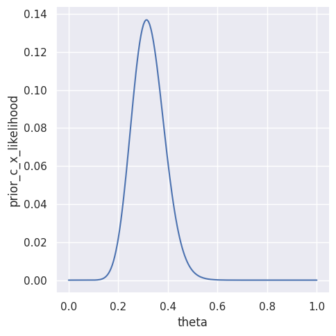
    


```python
# 事後モード
(ind,) = signal.argrelmax(df_3_4_c["prior_c_x_likelihood"].values)
posterior_mode = df_3_4_c.loc[ind, ["theta", "prior_c_x_likelihood"]].to_dict(
    orient="records"
)[0]
posterior_mode
```


    {'theta': 0.3165829145728643, 'prior_c_x_likelihood': 0.13681439196814513}


```python
def beta_mode(a, b):
    return (a - 1) / (a + b - 2)
```


```python
results_a["posterior_mode"] = beta_mode(
    results_a["a_posterior"],
    results_a["b_posterior"],
)
results_b["posterior_mode"] = beta_mode(
    results_b["a_posterior"],
    results_b["b_posterior"],
)
print("aの結果")
display(results_a)
print("bの結果")
display(results_b)
```

    aの結果


    {'a_posterior': 17,
     'b_posterior': 36,
     'posterior_mean': 0.32075471698113206,
     'posterior_var': 0.004034650528064555,
     'posterior_std': 0.0635188989834093,
     'credible_interval': (0.2032977878191033, 0.4510239822166316),
     'posterior_mode': 0.3137254901960784}


    bの結果


    {'a_posterior': 23,
     'b_posterior': 30,
     'posterior_mean': 0.4339622641509434,
     'posterior_var': 0.0045488706934061155,
     'posterior_std': 0.06744531631926798,
     'credible_interval': (0.30469562471174694, 0.567952795996458),
     'posterior_mode': 0.43137254901960786}


```python
df_3_4_d = pd.DataFrame(
    index=["a", "b", "c"],
    data={
        "prior": [
            "beta(2, 8)",
            "beta(8, 2)",
            r"$\frac{3}{4}$ beta(2, 8) + $\frac{1}{4}$ beta(8, 2)",
        ],
        "posterior_mode": [
            results_a["posterior_mode"],
            results_b["posterior_mode"],
            posterior_mode["theta"],
        ],
    },
)
Markdown(df_3_4_d.to_markdown())
```


|    | prior                                               |   posterior_mode |
|:---|:----------------------------------------------------|-----------------:|
| a  | beta(2, 8)                                          |         0.313725 |
| b  | beta(8, 2)                                          |         0.431373 |
| c  | $\frac{3}{4}$ beta(2, 8) + $\frac{1}{4}$ beta(8, 2) |         0.316583 |


上記の結果から事後モードは

$$
a \lesssim c < b
$$

### e

以下の事前分布を考える

$$
\begin{aligned}
p(\theta) 
&= \sum _{i=1}^{k} w_{i} \times dbeta(\theta, a_{i}, b_{i})
\\
& \quad where \quad 
\sum _{i=1}^{k} w_{i} = 1
\end{aligned}
$$

このとき、 d) ii.と同様の計算から事後分布は

$$
\begin{aligned}
p(\theta | y) &= 
\sum _{i=1}^{k}
\tilde{w}_{i}
\times
dbeta(\theta, a_{i} + y, b_{i} + n - y)
\end{aligned}
$$

となる。
ここで、 $\tilde{w}_{i}$ は事後分布の重みで、

$$
\tilde{w}_{i} = 
\frac{w_{i} B(a_{i} + y, b_{i} + n - y) / B(a_{i}, b_{i})}{\sum_{j=1}^{k} w_{j} B(a_{j} + y, b_{j} + n - y) / B(a_{j}, b_{j})} 
$$

である。 ベータ関数の対称性($B(a, b) = B(b, a)$)から、$a + b$ が一定のとき $\tilde{w}_{i}$ の $B(a_{i}, b_{i})$ の部分は分母分子でキャンセルする。(d.ii.で計算したパターン)

以上の結果から、事前分布で $w_{i} \times dbeta(a_{i}, b_{i})$ に対応する事後分布の成分は、 $w_{i} B(a_{i} + y, b_{i} + n - y) / B(a_{i} , b_{i})$ に比例する大きさの重みをもつ。
これは以下のように解釈することができる。

- **解釈1**: 事前分布で重視されている成分は事後分布でも重視される
    - 事後分布も事前分布の重み $w_{i}$ に比例するため
- **解釈2**: 信念が強い事前分布ほど重視する
    - $a_{i} + b_{i}$ が大きいほど $1/B(a_{i}, b_{i})$ が大きくなるため (下記ベータ関数のプロット参照)
    - $a_{i} + b_{i}$ が事前のサンプルサイズに対応することに注意
- **解釈3**: 極端な値をとる事前分布ほど重視する
    - $a_{i} + b_{i}$ が一定のとき、分子の $B(a_{i} + y, b_{i} + n - y)$ で差がつく
    - さらに$a + b$ が一定のとき、 $B(a, b)$ は $|a - b|$ が大きいほど(事前平均が極端な値をとるほど)大きくなる(下記ベータ関数のプロット参照)

### 参考: ベータ関数のプロット

ベータ関数をプロットしてみる


```python
def plot_beta_func(a_b_range: tuple):
    a_mesh, b_mesh = np.meshgrid(
        np.linspace(*a_b_range, 50),
        np.linspace(*a_b_range, 50),
    )

    df_beta_func = pd.DataFrame({"a": a_mesh.ravel(), "b": b_mesh.ravel()})
    df_beta_func["beta"] = special.beta(
        df_beta_func["a"].values,
        df_beta_func["b"].values,
    )

    contourplot(df_beta_func, x="a", y="b", z="beta")
```


```python
plot_beta_func((1, 3))
```


    
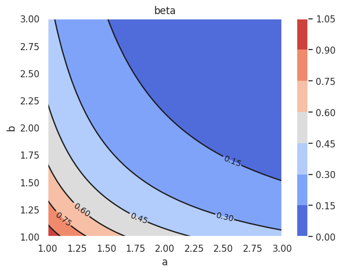
    


```python
plot_beta_func((1, 40))
```


    
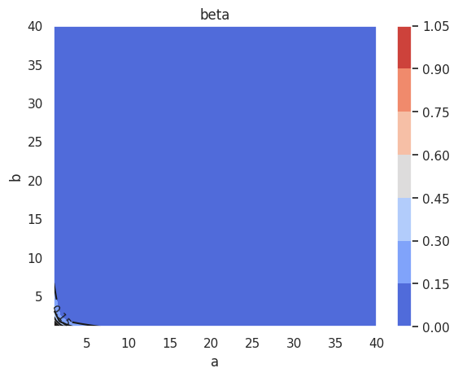
    


```python

```
